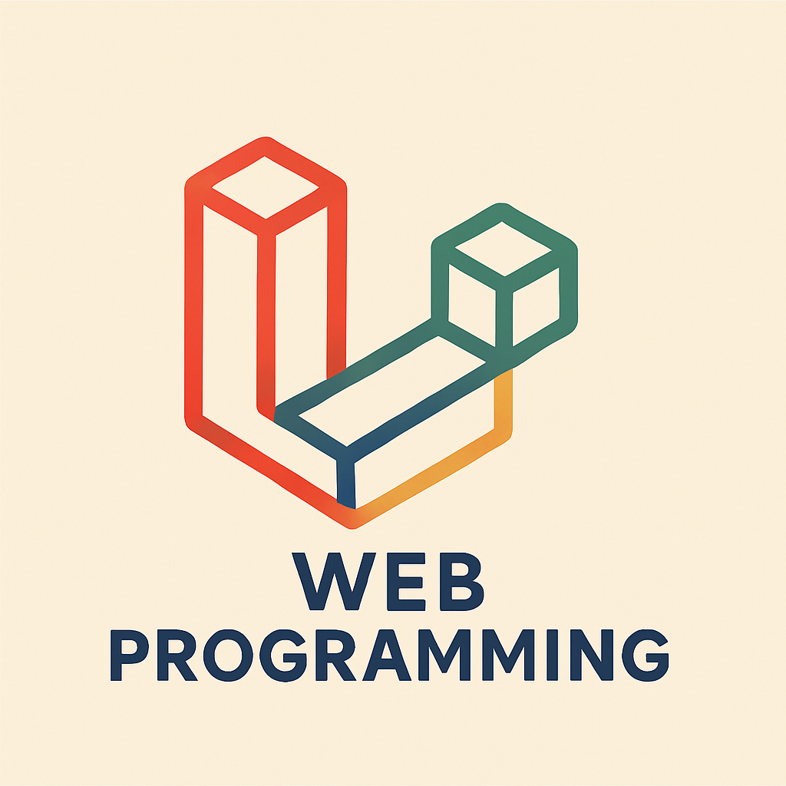

<table style="width: 100%; border: none;">
    <tr>
        <td valign="center" align="left" width="20%">
            
        </td>
        <td>
            <h1>Pemrograman Web Lanjut – Semester 4</h1>
            
Repository ini berisi kumpulan tugas untuk mata kuliah <strong>Pemrograman Web Lanjut</strong> pada semester 4. Setiap tugas dikelompokkan berdasarkan minggu pengerjaannya.

        </td>
    </tr>
</table>

# Data Diri
- **Nama**        : M. Fatih Al Ghifary  
- **NIM**         : 2341720194  
- **Kelas**       : TI-2  
- **Mata Kuliah** : Pemrograman Web Lanjut  

___

## Daftar Tugas

| Week | Courseware | Link |
|--------|-----------|------|
| 1 | (JS1) Instalasi Laravel & pembuatan project pertama | [Week 1](https://github.com/fateehhh/PROWEBLNJT/tree/main/Week%201) |
| 2 | - CRUD Sederhana   - PWL 2025   - POS | [Week 2](https://github.com/fateehhh/PROWEBLNJT/tree/main/Week%202) |
| 3 | Migration, Seeder, DB Façade, Query Builder, dan Eloquent ORM | [Week 3](https://github.com/fateehhh/PROWEBLNJT/tree/main/Week%203) |
| 4 | MODEL dan ELOQUENT ORM | [Week 4](https://github.com/fateehhh/PROWEBLNJT/tree/main/Week%204) |
| 5 | Blade View, Web Templating(AdminLTE), Datatables | [Week 5](https://github.com/fateehhh/PROWEBLNJT/tree/main/Week%205) |
| 5.2 | Blade View, Web Templating (AdminLTE), Datatables (Week | [Week 5 - Baru](https://github.com/fateehhh/PROWEBLNJT/tree/main/Week%205%20-%20Baru) |
| 6 | Ajax Form (AdminLTE) dan Client Validation | [Week 6](https://github.com/fateehhh/PROWEBLNJT/tree/main/Week%206) |
| 7 | Authentication dan Authorization | [Week 7](https://github.com/fateehhh/PROWEBLNJT/tree/main/Week%207) |
| 8 | File Import dan Export | [Week 8](https://github.com/fateehhh/PROWEBLNJT/tree/main/Week%208) |
| 9 | UTS | [Week 9](https://github.com/fateehhh/PROWEBLNJT/tree/main/PWL_POS) |
| 10 | RESTFUL API 1 | [Week 10](https://github.com/fateehhh/PROWEBLNJT/tree/main/Week%2010) |
| 11 | RESTFUL API 2 | [Week 11](https://github.com/fateehhh/PROWEBLNJT/tree/main/Week%2011) |

